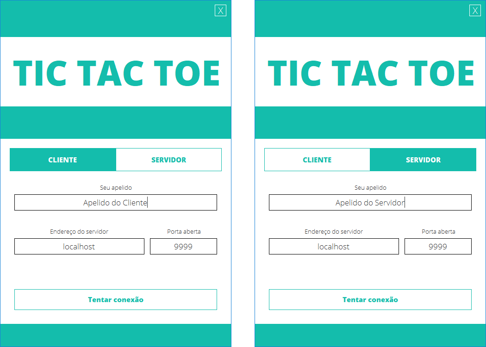
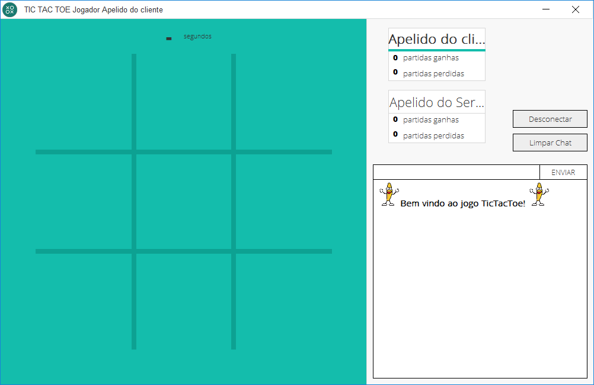
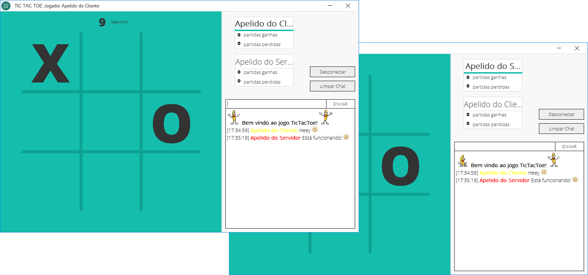

# Tic-Tac-Toe em Multiplayer em Rede usando Sockets
Um software desenvolvido em Java e com o auxílio do WindowBuilder para a síntese da interface gráfica. Usa os princípios de socket, cliente/servidor, para criar (inicialmente no localhost) partidas multiplayer de jogo da velha.

* O mesmo software pode exercer tanto a função de cliente quanto de servidor.
* É necessário que exista um software rodando como servidor para estabelecer uma conexão com o cliente.
* As duas aplicações necessariamente precisam usar a mesma porta.

*Para acessar mais imagens de pré-visualização [clique aqui](https://github.com/renanzan/TicTacToe_Client_Server/tree/master/preview)*

O jogo possui uma área de "tabuleiro", onde as jogadas podem ser efetuadas, e uma área de chat, para estabelecer uma comunicação direta com o adversário.

O jogo basei-se na troca de mensagens entre as duas aplicações, quando qualquer ação é tomada por ambas as partes ou uma mensagem é enviada através do botão do chat uma mensagem é disparada para a outra aplicação. Ambas as aplicações possuem um interpretador que trata as mensagens recebidas, processando e gerando um resultado gráfico para a outra aplicação, no caso os resultados possíveis são os seguintes:
* **(Start With "$MSG"):** Uma mensagem de jogada efetuada foi recebida e a jogada precisa ser executada no aplicativo em questão.
* **Emojis:** A mensagem é processada e qualquer sequência de caractere especial que possa representar um emoji é substituido por um trecho de código HTML que referencia a uma imagem do emoji na internet. Posteriormente esse trecho HTML será interpretado pelo elemento da interface gráfica.

* **(Start With "$POS"):** Uma mensagem de ação foi recebida que pode ser interpretada como uma jogada, essa mensagem vem acompanhada das coordenadas da jogada. Isso será interpretado pela aplicação e um resultado gráfico será gerado.

* **(Start With "$WIN"):** Uma mensagem de resultado foi recebida, está acompanhada do nome do jogador que venceu a partida, essa mensagem resultará em um alerta anunciando o vencedor.

* **(Start With "$TIED"):** Uma mensagem de empate, é solitária, não está acompanhada de nada, uma mensagem anunciando um empate será exiida na tela.

**Para fins de testes é possível hospeder o jogo para criar uma partida fora da rede local, para isso é necessário usar uma porta aberta do roteador.**

Existem muitas maneiras de rodar a aplicação fora do localhost, irei compartilhar uma das que eu testei e funcionou.
## Script de passos para rodar fora do localhost
> **Passo 1**
>> * Abrir uma porta do roteador

> **Passo 2**  
>> * Baixar e instalar o software [No-Ip](https://www.noip.com/)  

> **Passo 3**  
>> * Efetuar o login no site do No-Ip e criar um Host para a aplicação  

> **Passo 4**  
>> Selecionar o Host criado no software do No-Ip  
DUC v4.1.1 -> Refresh Now -> Edit Hosts -> Selecionar o Host criado para a aplicação -> Save

> **Passo 5**  
>> **Servidor** deve usar a porta que foi aberta no roteador  
>> **Cliente** deve usar a porta que foi aberta pelo servidor e o domínio do Host que foi criado pelo Servidor  
